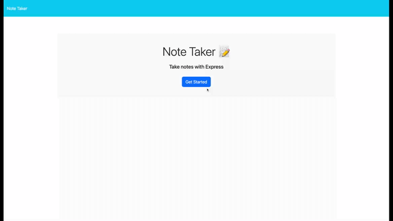

# Week 11 Express.js - Note Taker  

This application called Note Taker is intended for writing and saving notes.  The task is to build the back-end code, connect it with the already created front-end, and then deploy the entire application to Heroku. 

## User Story

```
AS A small business owner
I WANT to be able to write and save notes
SO THAT I can organize my thoughts and keep track of tasks I need to complete
```

# Technologies used

* HTML
* JS
* Express 4.18.2
* Heroku 8.1.8
* uuid 9.0.0

# How to Install

On the Visual Studio terminal do the following: 

* npm init
* npm i express
* npm i uuid
* create `.gitignore` file on root folder, then add `nodes_modules`
* On `/public/package.json` under `scripts:` add ` "start": "node server.js"` 

# How to Use 


## Mock-Up

The video below demonstrates how the application works. 



Here's the video link: (https://drive.google.com/file/d/1q6s4ogW_0Kozbe7n_CvYAa16DL05p7Ib/view)

# Repository